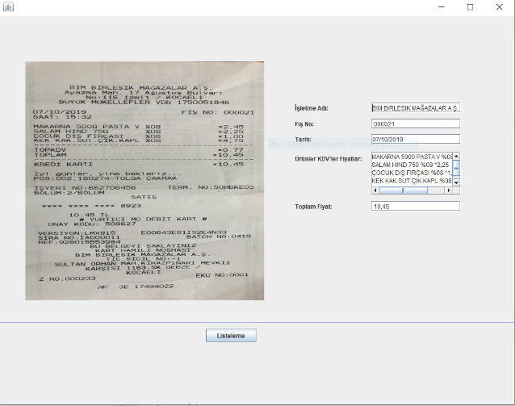

# Fis-Tanima-OCR-Tabanli

 Bu projede OCR tabanlı fiş tanıma uygulaması yapılmıştır. Dosyadan kaydedilmiş bir fiş görüntüsü okunur.
 Okunan görüntü Tesseract ile OCR işlemine girecektir. Parse edilmiş verilerden elde edilen tüm bilgiler arayüzde yazdırılmaktadır.
 Kullanıcı ekranında, veritabanına işlenen verilerden  işletme ad ve tarih  bazlı sorgulama yapılmaktadır. 
 
## Temel Bilgiler
Proje gelişiminde; 
Programlama dile olarak “Java”,geliştirme ortamı olarak Netbeans kullanılmıştır.                  
Arayüz tasarlamak için “Swing” kullanılmıştır. 
Veritabanı için “MySQL” kullanılmıştır. 
Ek olarak,MySQL Database’i Java uygulamasına bağlamak için PhpMyAdmin kullanılmıştır.  

Uygulamayı çalıştırabilmek için Tesseract ve OpenCV kurulu olmalıdır. 
Tesseract Kurulumu: https://www.youtube.com/watch?v=6sdhCwfP-lg&feature=youtu.be  
Netbeans’e  gerekli dosyaların eklenmesi: http://tess4j.sourceforge.net/tutorial/   
OpenCV Configuration: https://www.youtube.com/watch?v=C0ihmx1Ci08  

## Örnek

